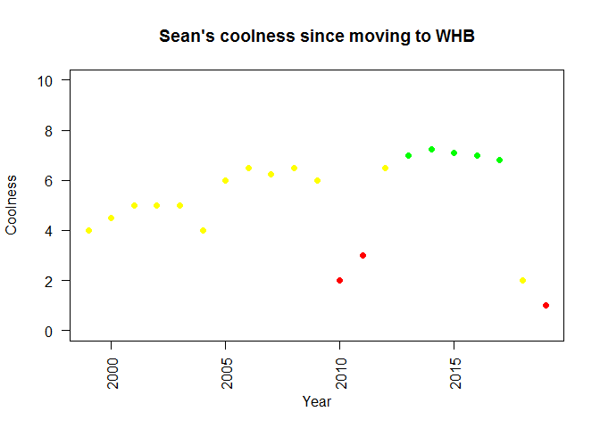

Peep dis shit
================
ehrlichd
7/11/2019

Here is my first RMarkdown Doc

I hope all my fans like it

``` r
##Here is my very first RMarkdown Doc

##I hope you like it

plot(1999:2019, type = "n", main = "Sean's coolness since moving to WHB", xlab = "Year", ylab = "Coolness", las = 2, ylim = c(0,10), xlim = c(1999,2019))
points(1999:2019, c(4, 4.5, 5, 5, 5, 4, 6, 6.5, 6.25, 6.5, 6, 2, 3, 6.5, 7, 7.25, 7.1, 7, 6.8, 2, 1), pch = 16, col = c(rep("yellow", 11), "red", "red", "yellow", rep("green", 5), "yellow", "red", "darkred"))
```

<!-- -->

If you liked this, be sure to smash the like button and subscribe for
more\!\!
