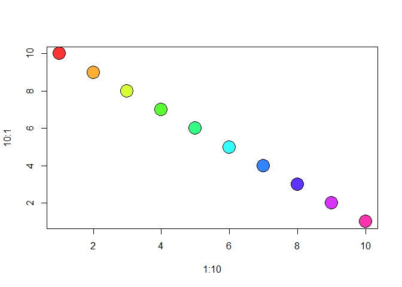

R scripts can be rendered\!
================
ehlrlichd
July 7, 2019

Rendering Rscript through Markdown: A Test

``` r
##Here's
###Some
####Normal
#####R text
```

And here are some data \!\!\!

``` r
matrix(c(1:10,10:1), ncol = 2, dimnames = list(1:10, c("X","Y")))
```

    ##     X  Y
    ## 1   1 10
    ## 2   2  9
    ## 3   3  8
    ## 4   4  7
    ## 5   5  6
    ## 6   6  5
    ## 7   7  4
    ## 8   8  3
    ## 9   9  2
    ## 10 10  1

``` r
plot(1:10, 10:1, pch = 21, bg = rainbow(10, s = .8), cex = 3)
```

<!-- -->

Neato\!\! Right???
